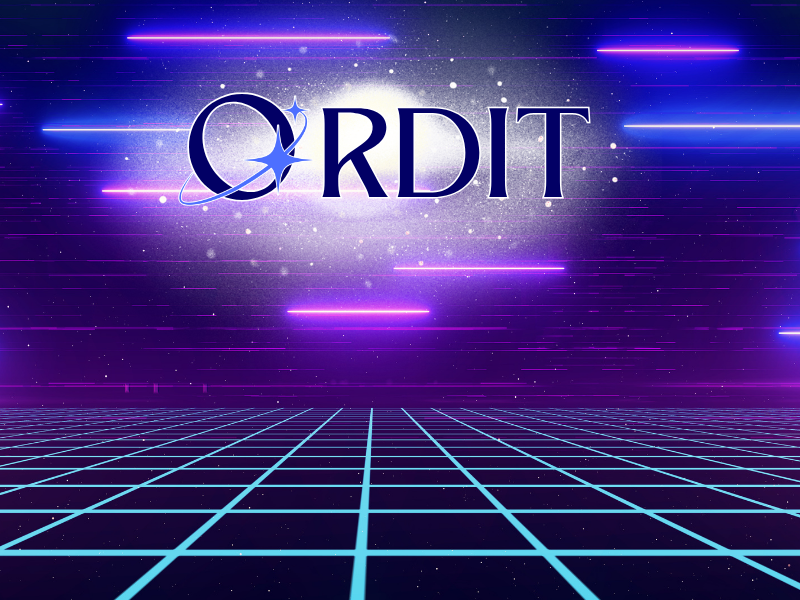
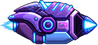
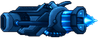
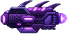
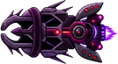
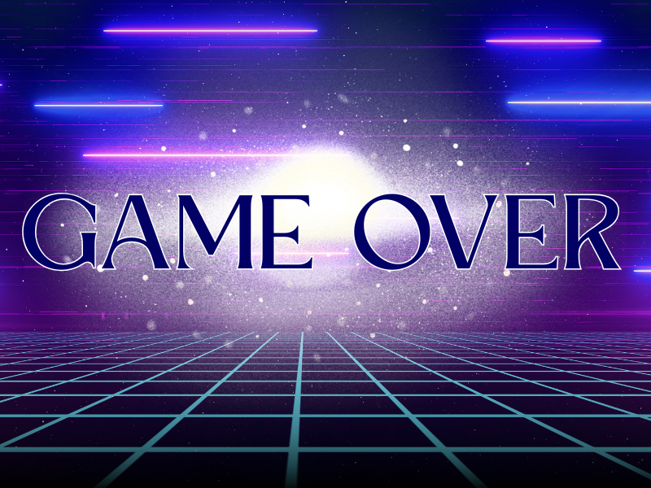
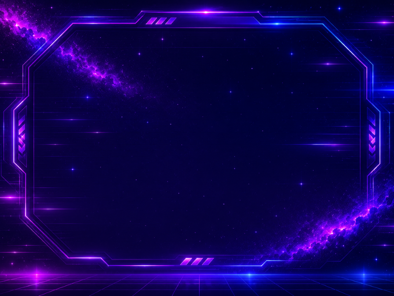

# 🚀 Orbit Shooter 🚀

<p align="center">
  
</p>

<p align="center">
  <strong>Um jogo arcade 2D desenvolvido em Python com Pygame, progressão em 4 fases, sistema de score, banco SQLite, tela de Game Over e executável para Windows.</strong>
</p>

<p align="center">
  
  
  
  
  
</p>

---

## 📌 Sobre o projeto

**Orbit Shooter** é um jogo de nave em estilo arcade/shooter 2D, desenvolvido como projeto acadêmico utilizando **Python** e **Pygame**.

O jogador deve sobreviver a uma sequência de fases espaciais, derrotar inimigos, acumular pontos e registrar sua pontuação em um ranking local. O projeto foi expandido com assets próprios, músicas personalizadas, efeitos sonoros, banco de dados, tela de vitória, tela de Game Over e empacotamento em executável para Windows.

<p align="center">
  
  &nbsp;&nbsp;&nbsp;
  
  &nbsp;&nbsp;&nbsp;
  
  &nbsp;&nbsp;&nbsp;
  
  &nbsp;&nbsp;&nbsp;
  
</p>

---

## 🎮 Gameplay

O jogo possui uma campanha com **4 fases progressivas**.

Cada fase tem:

- background próprio;
- música própria;
- inimigo específico;
- dificuldade progressiva;
- sistema de colisão;
- tiros dos jogadores e inimigos;
- tempo configurável por fase;
- score acumulado;
- vida persistente entre as fases.

### Progressão das fases

| Fase | Inimigo principal | Característica |
|---|---|---|
| Level 1 | Enemy 1 | Fase inicial, mais acessível |
| Level 2 | Enemy 2 | Dificuldade leve/moderada |
| Level 3 | Enemy 3 | Inimigos mais resistentes |
| Level 4 | Enemy 4 | Maior desafio da campanha |

<p align="center">
  
  
</p>

<p align="center">
  
  
</p>

---

## 🕹️ Modos de jogo

O menu principal oferece três formas de jogar:

| Modo | Descrição |
|---|---|
| Novo Jogo | Um jogador controla a nave principal |
| 2P Cooperativo | Dois jogadores jogam juntos e registram pontuação do time |
| 2P Competitivo | Dois jogadores competem entre si; vence quem fizer mais pontos |

No modo competitivo, ao final da campanha, o jogo mostra quem venceu antes de permitir o registro no ranking.

---

## ⌨️ Controles

### Player 1

| Ação | Tecla |
|---|---|
| Mover para cima | ↑ |
| Mover para baixo | ↓ |
| Mover para esquerda | ← |
| Mover para direita | → |
| Atirar | Ctrl direito |

### Player 2

| Ação | Tecla |
|---|---|
| Mover para cima | W |
| Mover para baixo | S |
| Mover para esquerda | A |
| Mover para direita | D |
| Atirar | Ctrl esquerdo |

---

## ✨ Funcionalidades implementadas

- ✅ Menu principal com opções de jogo, score e saída.
- ✅ Sistema de 4 fases com progressão.
- ✅ Efeito parallax com múltiplas camadas de background.
- ✅ Inimigos específicos para cada fase.
- ✅ Balanceamento progressivo de velocidade, vida, dano e pontuação.
- ✅ Modo single player.
- ✅ Modo 2 jogadores cooperativo.
- ✅ Modo 2 jogadores competitivo.
- ✅ Vida persistente entre as fases.
- ✅ Score acumulado durante a campanha.
- ✅ Tela de vitória.
- ✅ Mensagem de vencedor no modo competitivo.
- ✅ Tela de Game Over com áudio.
- ✅ Sistema de ranking Top 10.
- ✅ Banco de dados local com SQLite.
- ✅ Efeitos sonoros para tiros dos players e inimigos.
- ✅ Trilhas sonoras por fase.
- ✅ Executável para Windows gerado com cx_Freeze.

<p align="center">
  
  
  
  
  
  
</p>

---

## 🖼️ Telas do jogo

### Menu principal

<p align="center">
  
</p>

### Game Over

<p align="center">
  
</p>

### Ranking de pontuação

<p align="center">
  
</p>

---

## 🧠 Arquitetura do projeto

O projeto foi estruturado em módulos para separar responsabilidades e facilitar manutenção.

```text
Orbit_PyGame/
├── asset/                  # Imagens, músicas e efeitos sonoros
├── code/                   # Código-fonte principal do jogo
│   ├── Background.py       # Camadas de background/parallax
│   ├── Const.py            # Constantes globais do jogo
│   ├── DBProxy.py          # Comunicação com banco SQLite
│   ├── Enemy.py            # Classe dos inimigos
│   ├── EnemyShot.py        # Tiros dos inimigos
│   ├── Entity.py           # Classe base das entidades
│   ├── EntityFactory.py    # Criação centralizada de entidades
│   ├── EntityMediator.py   # Colisões, dano e remoção de entidades
│   ├── Game.py             # Fluxo principal do jogo
│   ├── Level.py            # Execução das fases
│   ├── Menu.py             # Menu principal
│   ├── Player.py           # Classe dos jogadores
│   ├── PlayerShot.py       # Tiros dos jogadores
│   └── Score.py            # Vitória, ranking e registro de score
├── main.py                 # Ponto de entrada do jogo
├── setup.py                # Configuração de build do executável
├── requirements.txt        # Dependências do projeto
└── README.md               # Documentação do projeto
```

---

## 🧩 Design Patterns e padrões aplicados

### 1. Factory / Simple Factory

Arquivo principal:

```text
code/EntityFactory.py
```

A `EntityFactory` centraliza a criação de entidades do jogo, como jogadores, inimigos e backgrounds.

Em vez de espalhar a criação de objetos por vários arquivos, o projeto usa um ponto único para construir entidades.

Exemplos de entidades criadas pela factory:

- `Player1`
- `Player2`
- `Enemy1`
- `Enemy2`
- `Enemy3`
- `Enemy4`
- backgrounds das fases

**Benefício:** facilita a manutenção e evita repetição de código.

---

### 2. Mediator

Arquivo principal:

```text
code/EntityMediator.py
```

O `EntityMediator` controla a comunicação entre entidades durante o jogo.

Ele verifica:

- colisão entre tiros e inimigos;
- colisão entre tiros e jogadores;
- remoção de entidades sem vida;
- atribuição de score ao jogador correto;
- descarte de tiros fora da tela.

Sem esse mediador, cada entidade precisaria conhecer várias outras entidades, deixando o código muito acoplado.

**Benefício:** reduz o acoplamento entre objetos e concentra regras de interação em um único lugar.

---

### 3. Proxy

Arquivo principal:

```text
code/DBProxy.py
```

O `DBProxy` atua como intermediário entre o jogo e o banco de dados SQLite.

Ele encapsula operações como:

- criar tabela se não existir;
- salvar score;
- buscar Top 10;
- fechar conexão.

O restante do jogo não precisa conhecer detalhes internos do SQLite.

**Benefício:** separa a lógica do banco da lógica do jogo.

---

### 4. Game Loop Pattern

Arquivos principais:

```text
code/Game.py
code/Level.py
```

O jogo utiliza o padrão clássico de game loop:

```text
capturar eventos → atualizar entidades → verificar colisões → renderizar tela
```

Esse ciclo acontece continuamente enquanto a fase está ativa.

**Benefício:** mantém o jogo rodando em tempo real com atualização constante de movimento, colisões e renderização.

---

### 5. Event-driven gameplay

Arquivo principal:

```text
code/Level.py
```

O projeto usa eventos do Pygame para controlar:

- spawn de inimigos;
- tempo restante da fase;
- fechamento da janela;
- entrada do teclado.

Exemplos:

- `EVENT_ENEMY`
- `EVENT_TIMEOUT`

**Benefício:** separa ações baseadas em tempo das ações baseadas em input do jogador.

---

### 6. Herança e Polimorfismo

Arquivo base:

```text
code/Entity.py
```

Classes como `Player`, `Enemy`, `Background`, `PlayerShot` e `EnemyShot` compartilham uma base comum: `Entity`.

Cada entidade possui propriedades como:

- imagem (`surf`);
- posição (`rect`);
- velocidade;
- vida;
- dano;
- score.

Mas cada tipo pode se comportar de forma diferente através de métodos próprios, como `move()` e `shoot()`.

**Benefício:** permite tratar objetos diferentes como entidades do jogo, mantendo comportamento específico em cada classe.

---

## 🗄️ Banco de dados

O jogo utiliza **SQLite** para armazenar o ranking local.

Arquivo responsável:

```text
code/DBProxy.py
```

Tabela criada automaticamente:

```sql
CREATE TABLE IF NOT EXISTS dados (
    id INTEGER PRIMARY KEY AUTOINCREMENT,
    name TEXT NOT NULL,
    score INTEGER NOT NULL,
    date TEXT NOT NULL
)
```

Campos armazenados:

| Campo | Descrição |
|---|---|
| id | Identificador automático |
| name | Nome do jogador ou time |
| score | Pontuação final |
| date | Data e hora do registro |

O banco é criado automaticamente quando o jogo precisa salvar ou consultar pontuações.

---

## 🔊 Áudio e identidade visual

O projeto utiliza assets próprios para criar identidade visual e sonora.

### Músicas

| Arquivo | Uso |
|---|---|
| `musicMenu.mp3` | Música do menu |
| `Level1.mp3` | Trilha da fase 1 |
| `Level2.mp3` | Trilha da fase 2 |
| `Level3.mp3` | Trilha da fase 3 |
| `Level4.mp3` | Trilha da fase 4 |
| `Score.mp3` | Tela de score/vitória |
| `GameOver.mp3` | Tela de Game Over |

### Efeitos sonoros

| Arquivo | Uso |
|---|---|
| `ShotPlayers.mp3` | Tiro dos jogadores |
| `ShotEnemies.mp3` | Tiro dos inimigos |

---

## 🛠️ Tecnologias utilizadas

| Tecnologia | Função no projeto |
|---|---|
| Python 3.12 | Linguagem principal |
| Pygame 2.6.1 | Motor gráfico e sonoro 2D |
| SQLite3 | Banco de dados local |
| cx_Freeze | Geração do executável |
| Git | Controle de versão |
| GitHub | Hospedagem do código |

---

## ▶️ Como executar pelo código-fonte

### 1. Clone o repositório

```bash
git clone https://github.com/seu-usuario/seu-repositorio.git
```

### 2. Acesse a pasta do projeto

```bash
cd Orbit_PyGame
```

### 3. Crie e ative o ambiente virtual

No Windows:

```bash
python -m venv .venv
.venv\Scripts\activate
```

### 4. Instale as dependências

```bash
pip install -r requirements.txt
```

### 5. Execute o jogo

```bash
python main.py
```

---

## 📦 Como gerar o executável

O projeto pode ser empacotado para Windows com `cx_Freeze`.

```bash
python setup.py build
```

Após o build, será criada uma pasta semelhante a:

```text
build/exe.win-amd64-3.12/
```

Dentro dela, execute:

```text
Orbit Shooter.exe
```

> Importante: para distribuir o jogo, envie a pasta inteira gerada pelo build, não apenas o arquivo `.exe`. O executável depende das pastas `asset` e `lib`.

---

## 🧪 Processo de desenvolvimento

O projeto foi desenvolvido de forma incremental, evoluindo de uma estrutura acadêmica inicial para uma versão mais personalizada e completa.

### Etapas principais

1. Estrutura inicial com Pygame.
2. Criação do menu principal.
3. Implementação dos jogadores.
4. Implementação dos inimigos.
5. Criação do sistema de tiros.
6. Desenvolvimento das colisões.
7. Criação dos backgrounds com parallax.
8. Expansão para 4 fases.
9. Balanceamento progressivo da dificuldade.
10. Adição de músicas e efeitos sonoros.
11. Implementação de Game Over.
12. Implementação de tela de vitória.
13. Criação do ranking com SQLite.
14. Geração do executável final.

---

## 🧱 Principais desafios técnicos

### Progressão de fases

O projeto foi adaptado para funcionar com uma lista de fases, permitindo que o jogo percorra `Level1`, `Level2`, `Level3` e `Level4` de forma sequencial.

### Vida persistente

A vida do jogador não é resetada ao trocar de fase. Isso cria uma experiência mais próxima de campanha, em que o desempenho em uma fase afeta a próxima.

### Score acumulado

A pontuação é mantida entre as fases e registrada apenas se o jogador concluir a campanha.

### Game Over sem salvar score

Caso todos os jogadores sejam derrotados, o jogo exibe a tela de Game Over e não registra pontuação no banco de dados.

### Ranking local

O sistema salva as 10 melhores pontuações usando SQLite, permitindo persistência mesmo após fechar o jogo.

---

## 📈 Melhorias futuras

Possíveis evoluções para próximas versões:

- [ ] Boss final na última fase.
- [ ] Sistema de power-ups.
- [ ] Tela de opções.
- [ ] Controle de volume.
- [ ] Suporte a joystick/gamepad.
- [ ] Novos tipos de inimigos.
- [ ] Animações de explosão.
- [ ] Sistema de conquistas.
- [ ] Barra visual de vida.
- [ ] Transição animada entre fases.
- [ ] Ranking separado por modo de jogo.
- [ ] Modo sobrevivência infinito.

---

## 📚 Aprendizados

Durante o desenvolvimento deste projeto foram praticados conceitos como:

- programação orientada a objetos;
- modularização em Python;
- manipulação de eventos com Pygame;
- colisões em jogos 2D;
- renderização de sprites;
- controle de FPS;
- persistência com SQLite;
- organização de assets;
- versionamento com Git;
- empacotamento de aplicações Python.

---

## ⚖️ Direitos autorais e uso acadêmico

Este projeto foi desenvolvido para fins acadêmicos e de portfólio.

Os assets visuais, músicas e efeitos sonoros foram organizados especificamente para este jogo, buscando identidade própria para o projeto.

```text
Copyright (c) 2026 Jhonatan Fernandes Santana
Todos os direitos reservados.
```

---

## 👨‍💻 Autor

Desenvolvido por **Jhonatan Fernandes Santana**.

Projeto acadêmico desenvolvido com Python, Pygame, SQLite e cx_Freeze.

<p align="center">
  
</p>

---

<p align="center">
  <strong>🚀 Orbit Shooter — sobreviva às fases, destrua inimigos e conquiste seu lugar no Top 10!</strong>
</p>
